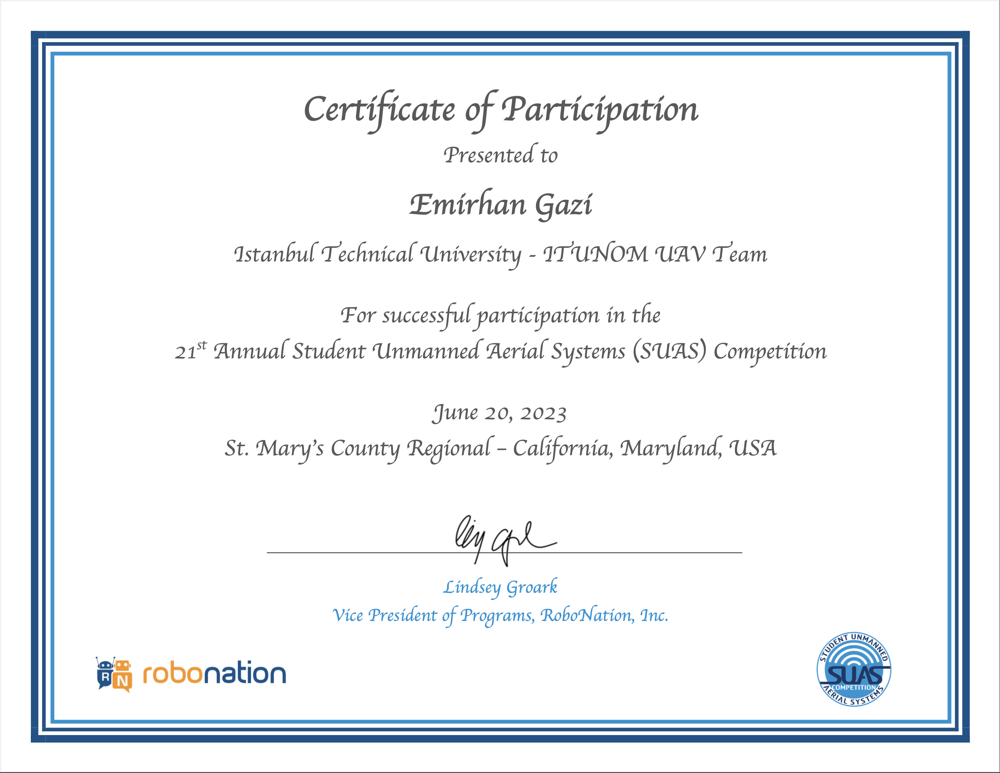

# Hi there! I'm Emirhan Gazi

  <h2>AI & Data Engineering Student | Reinforcement Learning Researcher | Computer Vision Specialist | Aviation Technology Enthusiast</h2>

  
  

## 🎓 Education

  
  

## 🚀 Current Roles

<table>
  <tr>
    <td></td>
    <td>Designing RL agents for drone control and multi-agent systems</td>
  </tr>
  <tr>
    <td></td>
    <td>Implementing LLMs and fine-tuning models for production</td>
  </tr>
  <tr>
    <td></td>
    <td>Sector based LLM and AI solutions </td>
  </tr>
  <tr>
    <td></td>
    <td>Anomaly detection and LLM applications in aviation</td>
  </tr>
</table>

## 🥇 Competition Awards
- **AUVSI SUAS 2023** - 🥇 1st Place Overall Ranking (World Championship)
- **AUVSI SUAS 2023** - 🥇 1st Place Mission Demonstration
- **AUVSI SUAS 2022** - 🥉 3rd Place Fixed-Wing Category
- **TEKNOFEST 2023** - 🥈 2nd Place International UAV Competition

## 🏆 Certifications

### Google Certification

  

### AUVSI SUAS Certification

  

## 🔬 Research Areas

  
  
  
  

## 💼 Featured Projects

  
| Project | Description | Tech Stack |
|---------|-------------|------------|
| **Finance Fine-Tuning LLM** | Stock market prediction using sentiment analysis |   |
| **Air Traffic Management RL** | Optimizing Istanbul Grand Airport traffic flow |   |
| **Multi-Policy Agent RL** | Single manager controlling multiple unit types |   |
| **Turkish Diacritization** | T5-based diacritical mark restoration |   |
| **AUVSI SUAS Vision System** | Complete computer vision pipeline for UAV |   |

## 🛠️ Tech Stack

### Programming Languages

### AI/ML Frameworks

### Specialized AI Tools

### Hardware & Embedded

### Development Tools

## 🎯 Current Focus

- 🔬 Developing **Group Relative Policy Optimization (GRPO)** for financial AI
- 🚁 Creating multi-drone coordination systems using reinforcement learning
- 🧠 Fine-tuning LLMs for domain-specific applications
- ✈️ Advancing AI applications in aviation and autonomous systems

## 🌐 Connect With Me

  
  
  

---

  

